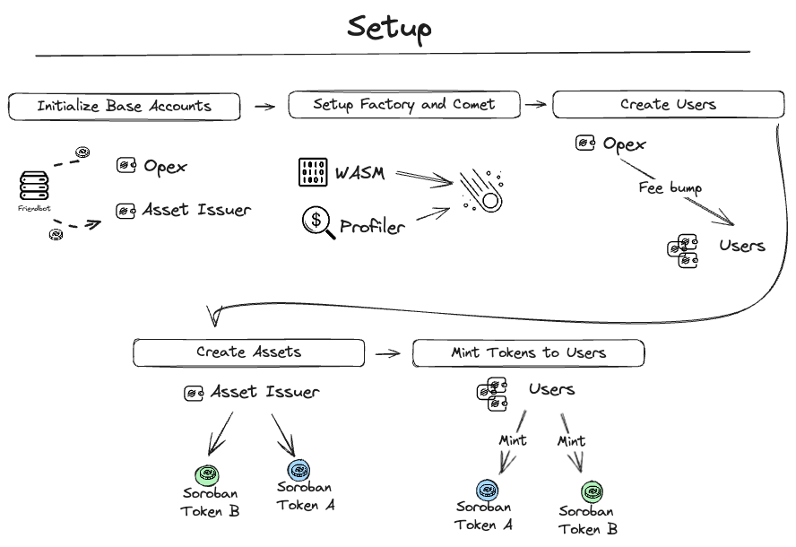

# Comet DEX Profiling

## Table of Contents

  - [Purpose](#purpose)
  - [StellarPlus Library Integration](#stellarplus-library-integration)
  - [Overview](#overview)
  - [Main Functionality](#main-functionality)
  - [Usage](#usage)
  - [Results achieved](#results-achieved)

## Purpose

This profiling use case is focused on obtaining resource utilization data from [Comet DEX](https://github.com/CometDEX/comet-contracts-v1/tree/main) protocol contracts. This work is part of a larger investigation which aims to collect data from various protocols in order to obtain an estimate of the resource utilization of Soroban contracts.

## StellarPlus Library Integration

This use case extensively utilizes the StellarPlus library, developed by Cheesecake Labs. Key integrations include:

- **Soroban Profiler**: Used for collecting, filtering, and formatting resource utilization data of all Soroban transactions. [Soroban Profiler Documentation](https://cheesecake-labs.gitbook.io/stellar-plus/reference/utils/soroban-profiler)

## Overview
Here are diagram showing the process of **setup** and **profiling** inside this example, each of these steps will be described below.

### Setup

<p align="center">
  
</p>

- **Initialize Base Accounts:**
  Creation and initialization of the Opex and Admin Issuer accounts.

```javascript
const { opex, admin } = await initializeBaseAccounts(network);
```

**Opex** is responsible to Fee Bump the transactions of Comet and Factory contracts.
**Admin** is responsible to issue the Token A and Token B.

- **Setup Factory and Comet:**
  Create Factory and Comet contracts.

```javascript
const factoryProfiler = new StellarPlus.Utils.SorobanProfiler();
  const factoryClient = new FactoryClient({
    network,
    wasm: factoryWasm,
    spec: factorySpec,
    contractId: factoryId,
    options: factoryProfiler.getOptionsArgs()
  });

  const cometProfiler = new StellarPlus.Utils.SorobanProfiler();
  const cometClient = new ContractClient({
    network,
    wasm: cometWasm,
    spec: contractsSpec,
    contractId: cometId,
    options: cometProfiler.getOptionsArgs()
  });
```

- **Create Users:**
    Opex creates demo users that will execute Comet transactions.

```javascript
  const users = await createUsers(nUsers, network, opexTxInvocation, ["SA4WTTZ4VEMC62TR27FECUDDQ7OAK3G4BUYEQQA3O75W4NZXPGXLOFVY"]);
```

- **Create Assets:**
  Admin creates Token A and Token B.

```javascript
  const { assetA, assetB } = await setupAssets(
    network,
    admin,
    adminTxInvocation,
    mintingForUsers,
  );
```

- **Mint Tokens To Users:**
Mints Tokens A and Tokens B to demo users, witch these, users will be able to perform deposits in Comet contract.

```javascript
  for (let user of mintingForUsers) {
    for (let asset of [assetA, assetB]) {
      await asset.mint({
        to: user.getPublicKey(),
        amount: BigInt(1000000000000000),
        ...txInvocation,
      })
    }
  }
```

### Profiling
Was made profiling in each of these functions:
- approve
- allowance
- balanceOf
- bundleBind
- burnFrom
- init
- bind
- unbind
- rebind
- finalize
- joinPool
- exitPool
- depositLPTokenAmountOutGetTokenIn
- depositTokenAmountInGetLPTokensOut
- withdrawTokenAmountInGetLPTokensOut
- withdrawTokenAmountOutGetLPTokensIn
- swapExactAmountIn
- swapExactAmountOut
- gulp
- setFreezeStatus
- setController
- setSwapFee
- setPublicSwap
- transfer
- transferFrom
- name
- symbol
- decimal
- isFinalized
- isPublicSwap
- isBound
- getController
- getDenormalizedWeight
- getTotalDenormalizedWeight
- getTotalSupply
- getSpotPrice
- getSpotPriceSansFee
- getSwapFee
- getDenormalizedWeight
- getBalance

## Main Functionality

### `cometDexProfiling` Function

- **Purpose**:
  To execute all transactions for profiling the performance of Comet DEX contracts.

- **Arguments**:

  - `nUsers`: Number of users for the profiling test. For now it only supports 1 user.
  - `network`: Stellar network configuration (e.g. testnet).

- **Output**:
  By default, all data collected can be found under `./src/export/comet`
  - `comet-data.csv`: Profiling data for Comet contract.
  - `factory-data.csv`: Profiling data for Factory contract.

## Usage

To execute the profiling, call the `cometDexProfiling` function with the desired configuration:

```javascript
cometDexProfiling({
  nUsers: 1,
  network: StellarPlus.Constants.testnet,
});
```

## Results achieved

The full results obtained can be seen at [this link](https://docs.google.com/spreadsheets/d/1PA5NoRsK92cPIrDpm64uuxAArrdUF7e41wboQbZxzCY/edit?pli=1#gid=0).
The table below shows an overview of the data from both contracts combined.

|                                   | Average    | Max        | Min       | Median     |
| --------------------------------- | ---------- | ---------- | --------- | ---------- |
| CPU Instructions                  | 19,424,139 | 38,773,267 | 5,019,842 | 18,253,538 |
| Memory (bytes)                    | 3,678,395  | 7,287,412  | 1,433,683 | 3,020,225  |
| Resource Fee (Stroops)            | 254,455    | 460,200    | 62,820    | 235,354    |
| Read (bytes)                      | 40,292     | 50,432     | 4,096     | 41,332     |
| Write (bytes)                     | 468        | 1,680      | 0         | 300        |
| Ledger Reads                      | 3          | 6          | 1         | 3          |
| Ledger Writes                     | 2          | 8          | 0         | 1          |
| Event & return value size (bytes) | 214        | 1,360      | 4         | 20         |
| Transaction size (bytes)          | 392        | 1,164      | 116       | 276        |
