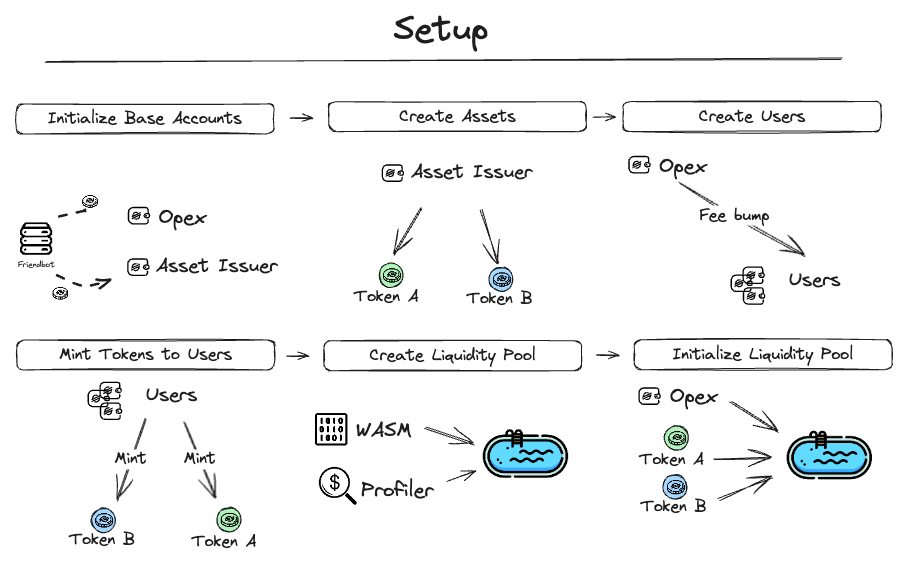
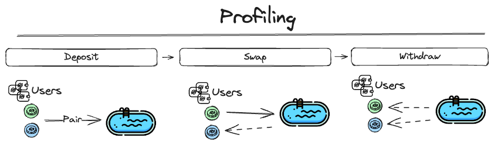

# Liquidity Pool Profiling

## Table of Contents

  - [Purpose](#purpose)
  - [StellarPlus Library Integration](#stellarplus-library-integration)
  - [Overview](#overview)
  - [Main Functionality](#main-functionality)
  - [Usage](#usage)
  - [Results achieved](#results-achieved)

## Purpose

This profiling use case provides an example of how to execute profiling on a Liquidity Pool contract in the Stellar Blockchain. The profiling is carried out using the stellar-plus library, which simplifies the process of interacting with Stellar blockchain and liquidity pool contracts.

**Important:** The Liquidity Poll WASM implementation available under `./src/dapps/liquidity-pool/wasm`, to generate you can execute the contract in the root of this repo in `./liquidity-pool`. Feel free to experiment custom implementations and/or optimized versions.

## StellarPlus Library Integration

This use case extensively utilizes the StellarPlus library, developed by Cheesecake Labs. Key integrations include:

- **Soroban Profiler**: Used for collecting, filtering, and formatting resource utilization data of all Soroban transactions. [Soroban Profiler Documentation](https://cheesecake-labs.gitbook.io/stellar-plus/reference/utils/soroban-profiler)
- **Soroban Token Handler**: A ready-to-use asset handler for deploying, instantiating, and invoking Soroban tokens. [Soroban Token Handler Documentation](https://cheesecake-labs.gitbook.io/stellar-plus/reference/asset/stellar-asset-contract-handler)
- **SAC Token Handler**: Manages Stellar Classic tokens with the Stellar Asset Contract, providing functions to wrap and invoke these assets. [SAC Token Handler Documentation](https://cheesecake-labs.gitbook.io/stellar-plus/reference/asset/soroban-token-handler)

## Overview
Here are diagram showing the process of **setup** and **profiling** inside this example, each of these steps will be described below.

### Setup

<p align="center">
  
</p>

- **Initialize Base Accounts:**
  Creation and initialization of the Opex and Asset Issuer accounts.

```javascript
const { opex, issuer } = await createBaseAccounts(networkConfig);
```

**Opex** is responsible to Fee Bump the transactions of Liquidity Pool.
**Issuer** is responsible to issue the Token A and Token B.

- **Create Assets:**
  Issuer creates Token A and Token B.

```javascript
const { assetA, assetB } = await createAsset({
    networkConfig: networkConfig,
    txInvocation: issuer.transactionInvocation,
    validationCloudApiKey,
  });
```
- **Create Users:**
    Opex creates demo users that will execute Liquidity Pool transactions.

```javascript
  const users: DemoUser[] = await setupDemoUsers({
    nOfUsers: nUsers,
    networkConfig,
    feeBump: opex.transactionInvocation,
  });
```
- **Mint Tokens To Users:**
Mints Tokens A and Tokens B to demo users, witch these, users will be able to perform deposits in Liquidity Pool.

```javascript
  await mintSorobanTokensToUsers({
    users,
    issuer,
    token: assetA,
    mintAmount: mintAmountSorobanToken,
  });
```

- **Create Liquidity Pool:**
With the necessary wasm and Opex, is create two plugins to add in contract: **ProfilerPlugin** (responsible to analyze costs), **AutoRestorePlugin** (responsible to restore contract case is expired).

```javascript
  const liquidityPoolProfiler = new ProfilerPlugin();
  const autoRestorePlugin = new AutoRestorePlugin(txInvocation, networkConfig)

  const liquidityPoolContract = new LiquidityPoolContract({
    networkConfig: networkConfig,
    contractParameters: {
      spec: liquidityPoolSpec,
      wasm: liquidityPoolWasm,
    },
    options: {
      sorobanTransactionPipeline: {
        plugins: [liquidityPoolProfiler, autoRestorePlugin]
      },
    }
  })
```

- **Initialize Liquidity Pool:**
After create, is initialize Liquidity Pool with assets that will be the pair and Opex, responsible to fee bump the transactions.

```javascript
await liquidityPoolContract.initialize({
  tokenWasmHash: tokenWasmHash,
  tokenA: assetAId,
  tokenB: assetBId,
  txInvocation: txInvocation
})
```

### Profiling

<p align="center">
  
</p>

- **Deposit:**
Adding funds or assets into the liquidity pool. Users contribute their assets to the pool to increase its overall liquidity, which enables trading and other activities within the ecosystem.

```javascript
  await profileDeposit({
      liquidityPoolContract: liquidityPoolContract,
      nTransactions: nTransactions,
      users: users,
    });
```

- **Swap:**
Swapping, also known as trading or exchanging, involves the exchange of one asset for another within the liquidity pool. Users can initiate swaps to trade their assets against the available liquidity in the pool.

```javascript
  await profileSwap({
      liquidityPoolContract: liquidityPoolContract,
      nTransactions: nTransactions,
      users: users,
    });
```

- **Withdraw:**
efers to the action of removing funds or assets from the liquidity pool. Users may choose to withdraw their assets from the pool for various reasons, such as realizing profits, rebalancing their portfolios, or exiting their positions.

```javascript
  await profileWithdraw({
      liquidityPoolContract: liquidityPoolContract,
      nTransactions: nTransactions,
      users: users,
    });
```

## Main Functionality

### `liquidityPoolProfiling` Function

- **Purpose**:
  To execute a most used transactions in liquidity pool, profiling the performance between all contract methods.

- **Arguments**:

  - `nUsers`: Number of users for the profiling test. Whenever possible, the transactions will be parallelized with the number of users available.
  - `nTransactions`: Number of transactions to be executed.
  - `network`: Stellar network configuration (e.g. testnet).
  - `transactions`: Types of transactions to be profiled (transfer, mint, burn).
  - `validationCloudApiKey`: API key to use your custom Validation Cloud RPC isntead of the default one.

- **Output**:
  By default, all data collected can be found under `./src/export`
  - `liquidity_pool_profiling_sac.csv`: Profiling data for Liquidity Pool contract.

## Usage

To execute the profiling, call the `liquidityPoolProfiling` function with the desired configuration:

```javascript
liquidityPoolProfiling({
  nUsers: 5,
  nTransactions: 100,
  network: StellarPlus.Constants.testnet,
  transactions: [
    liquidityPoolTransactions.deposit,
    liquidityPoolTransactions.swap,
    liquidityPoolTransactions.withdraw,
    liquidityPoolTransactions.get_rsrvs,
  ],
  validationCloudApiKey: "<Your_ValidationCloud_API_Key>",
});
```

## Results achieved

The results for each resource cost per method can be seen in the table below.

| Method     | CPU Instructions | Memory (bytes) | Resource Fee (Stroops) | Read (bytes) | Write (bytes) | Ledger Reads | Ledger Writes | Event & return value size (bytes) | Transaction size (bytes) |
| ---------- | ---------------- | -------------- | ---------------------- | ------------ | ------------- | ------------ | ------------- | --------------------------------- | ------------------------ |
| initialize | 8,115,183        | 3,345,027      | 149,509                | 19,132       | 628           | 2            | 2             | 4                                 | 200                      |
| share_id   | 4,723,482        | 1,751,828      | 95,354                 | 11,856       | 0             | 2            | 0             | 40                                | 116                      |
| deposit    | 21,699,746       | 9,644,244      | 333,484                | 20,520       | 1,068         | 5            | 6             | 528                               | 868                      |
| swap       | 18,374,952       | 8,079,149      | 276,289                | 20,516       | 920           | 4            | 5             | 356                               | 704                      |
| withdraw   | 28,464,766       | 12,769,320     | 412,318                | 20,956       | 1,212         | 5            | 7             | 708                               | 980                      |
| get_rsrvs  | 4,733,393        | 1,752,068      | 95,483                 | 11,856       | 0             | 2            | 0             | 52                                | 116                      |

TODO: Add parallel execution and runtime results.
