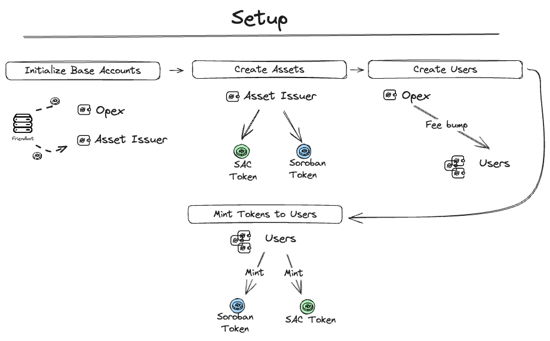
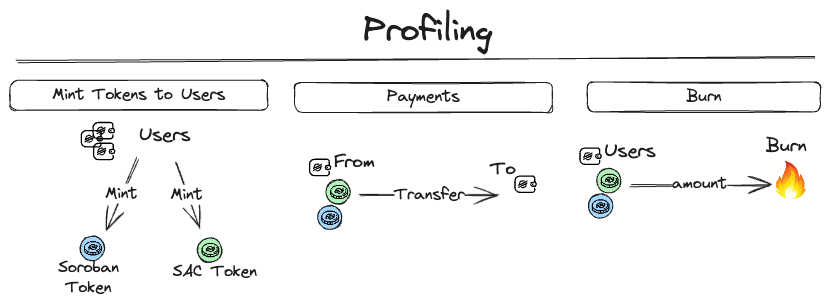

# Token Profiling

## Table of Contents

  - [Purpose](#purpose)
  - [StellarPlus Library Integration](#stellarplus-library-integration)
  - [Overview](#overview)
  - [Main Functionality](#main-functionality)
  - [Usage](#usage)
  - [Results achieved](#results-achieved)

## Purpose

This profiling use case is focused on comparing the performance of Classic Stellar tokens wrapped in the Stellar Asset Contract (SAC) versus pure Soroban Tokens. It aims to provide insights into efficiency, resource utilization, and performance differences between these token types.

**Important:** The pure Soroban token uses the WASM implementation available under `./src/dapps/soroban-token/wasm`. Feel free to experiment custom implementations and/or optimized versions.

## StellarPlus Library Integration

This use case extensively utilizes the StellarPlus library, developed by Cheesecake Labs. Key integrations include:

- **Soroban Profiler**: Used for collecting, filtering, and formatting resource utilization data of all Soroban transactions. [Soroban Profiler Documentation](https://cheesecake-labs.gitbook.io/stellar-plus/reference/utils/soroban-profiler)
- **Soroban Token Handler**: A ready-to-use asset handler for deploying, instantiating, and invoking Soroban tokens. [Soroban Token Handler Documentation](https://cheesecake-labs.gitbook.io/stellar-plus/reference/asset/stellar-asset-contract-handler)
- **SAC Token Handler**: Manages Stellar Classic tokens with the Stellar Asset Contract, providing functions to wrap and invoke these assets. [SAC Token Handler Documentation](https://cheesecake-labs.gitbook.io/stellar-plus/reference/asset/soroban-token-handler)


## Overview
Here are diagram showing the process of **setup** and **profiling** inside this example, each of these steps will be described below.

### Setup

<p align="center">
  
</p>

- **Initialize Base Accounts:**
  Creation and initialization of the Opex and Asset Issuer accounts.

```javascript
const { opex, issuer } = await createBaseAccounts(network);
```

**Opex** is responsible to Fee Bump the transactions of Tokens.
**Issuer** is responsible to issue the Token A and Token B.

- **Create Assets:**
  Issuer creates sorobanToken, sacToken and tokenProfiler.

```javascript
  const { sorobanToken, sacToken, tokenProfiler, sacProfiler } =
    await setupAssets(
      network,
      issuer.account,
      issuer.transactionInvocation,
      validationCloudApiKey
    );
```
- **Create Users:**
    Opex creates demo users that will execute tokens transactions.

```javascript
  const users: DemoUser[] = await setupDemoUsers({
    nOfUsers: nUsers,
    network,
    feeBump: opex.transactionInvocation,
    addTrustline: [
      {
        asset: sacToken.classicHandler,
        mintAmount: "1",
      },
    ],
  });
```
- **Mint Tokens To Users:**
Mints sorobanToken and sacToken to demo users, witch these, users will be able to perform payments and burn in example.

```javascript
  await mintSorobanTokensToUsers({
    users,
    issuer,
    token: sorobanToken,
    mintAmount: mintAmountSorobanToken,
  });
```

### Profiling

<p align="center">
  
</p>

- **Mint:**
Same as mint in setup, creates sorobanToken and sacToken for demo users.

```javascript
  await profileMinting({
      nTransactions,
      users,
      issuer,
      sorobanToken,
    });
```

- **Payments:**
Perform transfer asset from one user to another.

```javascript
  await profilePayments({
      nTransactions,
      users,
      issuer,
      sorobanToken,
    });
```

- **Burn:**
Removing sorobanToken and sacToken asset from circulation.

```javascript
  await profileBurn({
      nTransactions,
      users,
      issuer,
      sorobanToken,
    });
```


## Main Functionality

### `tokensProfiling` Function

- **Purpose**:
  To execute a series of transactions for profiling the performance between SAC and Soroban Tokens.

- **Arguments**:

  - `nUsers`: Number of users for the profiling test. Whenever possible, the transactions will be parallelized with the number of users available.
  - `nTransactions`: Number of transactions to be executed.
  - `network`: Stellar network configuration (e.g. testnet).
  - `transactions`: Types of transactions to be profiled (transfer, mint, burn).
  - `validationCloudApiKey`: API key to use your custom Validation Cloud RPC isntead of the default one.

- **Output**:
  By default, all data collected can be found under `./src/export`
  - `assets_profiling_sac.csv`: Profiling data for SAC tokens.
  - `assets_profiling_token.csv`: Profiling data for Soroban Tokens.

## Usage

To execute the profiling, call the `tokensProfiling` function with the desired configuration:

```javascript
tokensProfiling({
  nUsers: 5,
  nTransactions: 100,
  network: StellarPlus.Constants.testnet,
  transactions: [
    tokenTransactions.burn,
    tokenTransactions.mint,
    tokenTransactions.transfer,
  ],
  validationCloudApiKey: "<Your_ValidationCloud_API_Key>",
});
```

## Results achieved

The full results obtained can be seen at [this link](https://lookerstudio.google.com/reporting/5e685214-ac72-4d7d-bea0-a6940f27bd19/page/5GHmD).
Based on the test results, SAC tokens demonstrated significant resource efficiency compared to Soroban tokens. For example, in terms of CPU instructions, SAC tokens consumed approximately 2.19% compared to Soroban tokens.
The chart below shows the difference in fees charged for each contract.


