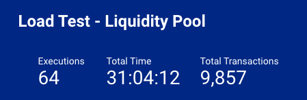
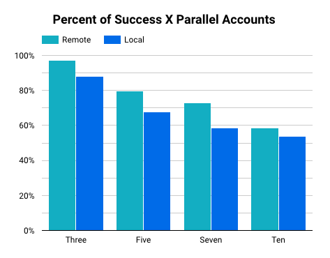

# Load Test in Liquidity Pool

Here we have a example of how implement a load test using Shell Scrip/Soroban CLI.

## Load Test

The main goal of load test is examines behavior under an expected high load, normally is simulating with multiple users accessing the program concurrently, and analyzing behavior under various conditions;

## Description

Was build Load Test under different conditions and collected the results,
each test variable is described below:
- **Scenario**: Set of functions and parameters that will be executed in the tests.
- **Parallel Accounts**: Number of accounts executing requests in parallel 
- **Network**: 
  - **Testnet**: Free-to-use network maintained by SDF that functions like the Pubnet but doesn’t connect to real money.
  - **Futurenet**: Native smart contracts platform on the Stellar network, incentivized testing environment for first-wave developers;
- **RPC**: Service allows you to communicate directly with Soroban (live network gateway for Soroban);
    - **Local**
    - **Remote**
- **Functions**: Deposit, Swap, Withdraw, Get Resources.

# How to execute

## Initialize the Contracts
Run the `initialize.sh` script to deploy and initialize the liquidity pool contracts:

```sh
$ ./initialize.sh
```
This script will set up the necessary smart contracts and configure the initial state for the load test.

## Configuration
Adjust the load test configurations by editing the `config.sh` file:
```sh
$ nano config.sh
```
Specify parameters such as the number of users, number of transactions, network, and any other relevant settings for your load test.

## Run Load Test
Execute the following command to start the load test:
```sh
$ make run
```
This will launch the load test using the configurations from `config.sh`. The script will simulate user interactions with the liquidity pool based on the specified parameters. 

## View Results
Upon completion, the results of the load test will be saved in the invoke-log.csv file. You can analyze this file to review transaction details, response times, and other relevant metrics:

```sh
$ cat invoke-log.csv
```

## Previous Load Test Results

<p align="center">
  <a href="https://cheesecakelabs.com/en/">
    
  </a>
  <a href="https://www.stellar.org/learn/intro-to-stellar">
    
  </a>
</p>
If you would like to review the results of a previously executed load test, you can find them at the following link:

[View Previous Load Test Results](https://lookerstudio.google.com/reporting/1aa5e3d5-fc04-4b5a-a5e9-3132c2a14544)

Feel free to analyze the data to gather insights into transaction performance, response times, and other relevant metrics.

